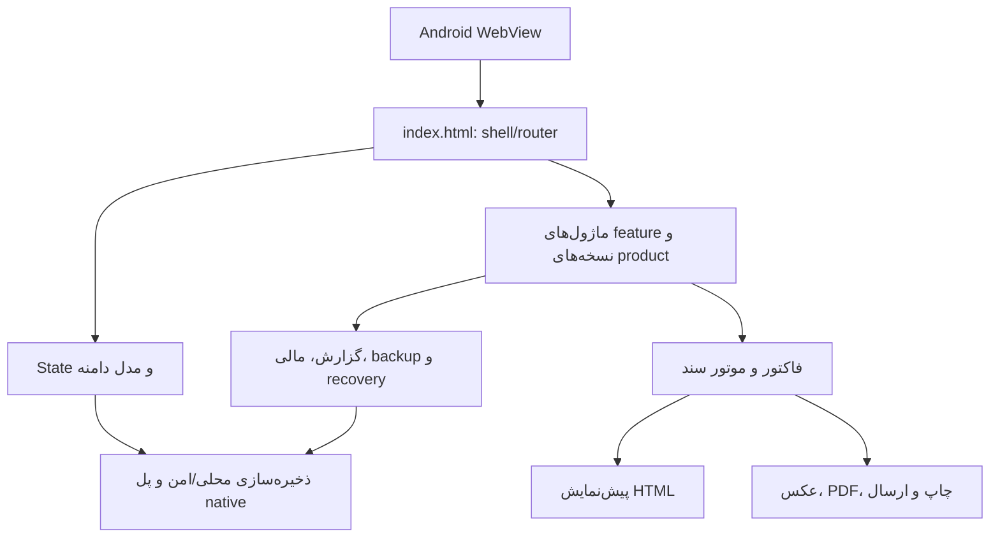

# گزارش بررسی معماری پروژه AS

این گزارش بر اساس بررسی نسخه استخراج‌شده از AS.zip در مسیر App-Demo-Clone-main تهیه شده است. این نسخه شامل ۱۴۱ فایل است و در مجموع تقریباً ۵۰ تا ۶۰ مگابایت حجم دارد. بررسی متنی نام‌های قبلی در نسخه فعلی نتیجه‌ای نداشت؛ با این حال قبل از انتشار باید نام‌های داخل متادیتای باینری و قرارداد WebView نیز جداگانه اعتبارسنجی شوند.

## نتیجهٔ معماری

پروژه یک برنامهٔ آفلاین و موبایل‌محور است که هستهٔ رابط و منطق آن در یک صفحهٔ HTML بزرگ اجرا می‌شود. index.html نقش shell، router، state manager، قالب‌های UI و بخش زیادی از منطق دامنه را هم‌زمان دارد. این صفحه در یک WebView اندروید میزبانی می‌شود؛ بنابراین آنچه در مخزن فعلی دیده می‌شود بیشتر لایهٔ وب/دارایی‌های برنامه است، نه یک پروژهٔ کامل و مستقل Gradle.

فایل‌های Kotlin/Java، build.gradle و AndroidManifest.xml قابل‌ساخت در این درخت پیدا نشدند. پوشهٔ binary_reference شامل خروجی باینری/نمونهٔ APK است و برای شناخت بستهٔ اندروید مفید است، اما جای سورس wrapper اندروید را نمی‌گیرد. در نتیجه backend شبکه‌ای یا سرور قابل مشاهده نیست؛ داده‌ها عمدتاً محلی‌اند و «backend» واقعی برنامه همان لایهٔ دادهٔ JavaScript، ذخیره‌سازی مرورگر/WebView و پل native است.

## لایه‌ها و مسئولیت‌ها

| لایه | محل/نمونه | مسئولیت |
|---|---|---|
| Host اندروید | WebView و binary_reference | اجرای assetها، چرخهٔ عمر برنامه و در صورت وجود، پل native |
| Shell و UI | app/src/main/assets/index.html | RTL، طراحی موبایل، ناوبری، modal، toast، فرم‌ها، رندر صفحه‌ها و رویدادها |
| State و دامنه | state/data سراسری داخل index.html و product_core_v3962.js | مشتری، کالا، خرید، فروش، فاکتور، پرداخت، چک، کارگاه/رزرو، گزارش و تنظیمات |
| ماژول‌های تکمیلی | product_v39*.js | قابلیت‌های مرحله‌ای، اصلاحات نسخه‌ای، گزارش، آرشیو، backup، امنیت و UX |
| موتور سند | document_engine_v2.js | آماده‌سازی خروجی سند، پیش‌نمایش، عکس/PDF/چاپ/ارسال و cache خروجی |
| فاکتور | invoice_full_shell_data_v3970.js و invoice_templates_v3970.js | قالب، جدول اقلام، جمع‌ها، لوگو، مهر، امضا و خروجی چاپی |
| ذخیره‌سازی | wrapperهای ذخیره‌سازی داخل HTML + local/secure/native bridge | نگهداری داده، تنظیمات، دارایی‌ها، backup و بازیابی |

## صفحه‌ها و جریان‌های قابل تشخیص

ناوبری اصلی از طریق bottom navigation و مقدار state.tab انجام می‌شود: خانه، مشتریان، فاکتور، خریدها، امور مالی، اجرا/کارها، کارگاه، مرکز کارگاه، گزارش‌ها، پورتفولیو، پشتیبان‌گیری، سطل زباله، تنظیمات و کاتالوگ RAL کلاسیک. صفحه‌های داخلی برای حساب مشتری، پیش‌نمایش سند، پیگیری، اعلان مشتری، فایل‌ها، پرداخت، صورت‌حساب و خلاصه نیز وجود دارند.

- خانه: خلاصهٔ شاخص‌ها و میانبرهای عملیاتی.
- مشتریان: فهرست، جست‌وجو، بدهکار/بستانکار، پروفایل و تاریخچه.
- فاکتور: مشتری و اقلام، محاسبه، قالب، مهر/امضا و preview/عکس/PDF/چاپ/ارسال.
- خریدها: فروش/خرید کالا و موجودی مرتبط.
- مالی: پرداخت‌ها، بدهی، بستانکاری، چک و خلاصهٔ جریان مالی.
- کارگاه/رزرو/اجرا: ثبت و پیگیری کارها و خدمات.
- گزارش‌ها و پورتفولیو: خروجی تحلیلی و نمایش سوابق.
- backup: بازیابی، چندنسخه‌ای‌سازی، recovery، export قابل‌حمل و integrity.
- تنظیمات: اطلاعات کسب‌وکار، فونت، لوگو، مهر، امضا و قالب.

## جریان داده و UX/UI

رابط mobile-first و RTL است؛ bottom navigation، topbar چسبان، کارت‌های گرد، فرم تک‌ستونه، modal bottom-sheet و toast دارد. مسیر غالب کاربر: انتخاب مشتری ← انتخاب اقلام ← محاسبه و پرداخت ← انتخاب قالب/هویت بصری ← پیش‌نمایش ← خروجی یا ارسال.

## ایرادها و ریسک‌ها

1. index.html بسیار بزرگ و چندمنظوره است و UI، routing، state و منطق دامنه را کوپل کرده است.
2. فایل‌های product_v39... نسخه‌ای و stageای هستند و ترتیب بارگذاری آن‌ها مهم است.
3. backend سرویس‌محور یا API سروری دیده نمی‌شود و داده به storage محلی و wrapper native وابسته است.
4. سورس کامل Android wrapper حاضر نیست؛ build، مجوزها، share، فایل‌سیستم و bridge تضمین‌پذیر نیستند.
5. تغییر نام bridge و کلیدهای storage به AS باید با wrapper واقعی هماهنگ شود.
6. موتور سند حدود ۲۶ مگابایت و دادهٔ shell فاکتور حدود ۵ مگابایت است؛ مصرف حافظه و زمان بارگذاری ریسک دارد.
7. binary reference جایگزین سورس build نیست و بازتولید release را دشوار می‌کند.
8. تست خودکار کافی دیده نشد؛ smoke test برای routing، storage، فاکتور و backup لازم است.

## مبنای ادامهٔ توسعه

ابتدا قرارداد state/storage و bridge ثابت و مستند می‌شود؛ سپس featureها از index.html جدا می‌شوند؛ بعد موتور سند و backup با تست رفتاری ایزوله می‌شوند. تا زمان ارائهٔ سورس wrapper یا قرارداد دقیق bridge، تغییرات native نقطهٔ پرریسک محسوب می‌شوند.
